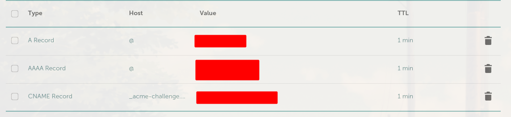

# uWebSockets

We're using [uWebSockets.js](https://github.com/uNetworking/uWebSockets.js/) because it has builtin support for pub/sub

- It must be compiled from source (no npm)
  - `git clone --recursive https://github.com/uNetworking/uWebSockets.js.git uws`
  - `cd uws && make`
  - files will be in dist
  - The `.node` files are checked into Github since compiling takes a while
  - For some reason, the `.node` file must be copied into the build/ directory

# DevEx

- Use `dev-with-hot-reloading` in order to get automatic page refresh / hot-reloading when changing site source code
  - This will not run the websocket server
- Use `dev` when developing websocket code (it will automatically restart `server.ts`)

# Remix

[Remix Docs](https://remix.run/docs)

# Custom Domain

- https://fly.io/docs/app-guides/custom-domains-with-fly/
- Here's what the end result looks like on namecheap:
  - 
